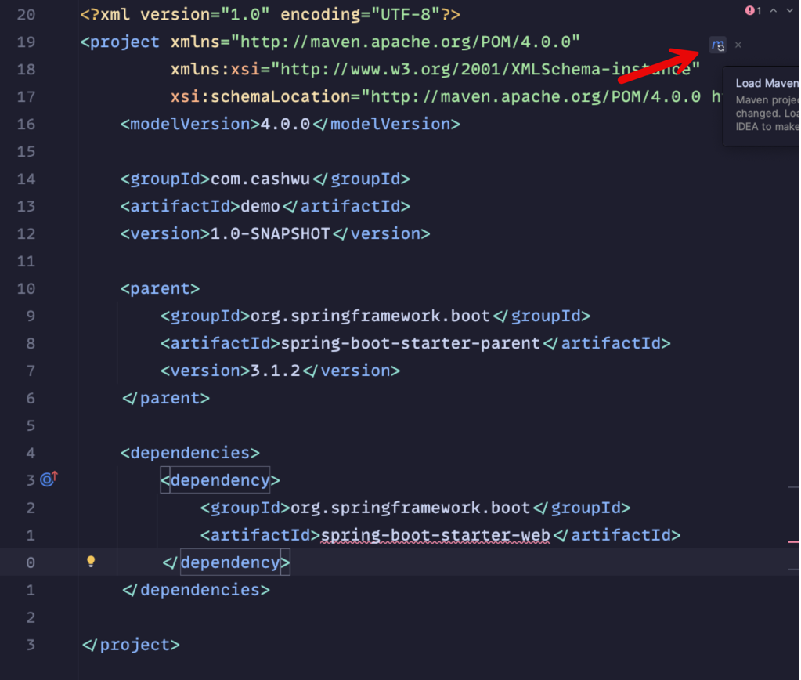

https://docs.spring.io/spring-boot/docs/current/reference/htmlsingle/#getting-started.first-application


- Maven


```xml
<parent>
    <groupId>org.springframework.boot</groupId>
    <artifactId>spring-boot-starter-parent</artifactId>
    <version>3.2.2</version>
</parent>
```



- Starters
- https://docs.spring.io/spring-boot/docs/current/reference/htmlsingle/#using.build-systems.starters

```xml
<dependencies>
    <dependency>
        <groupId>org.springframework.boot</groupId>
        <artifactId>spring-boot-starter-web</artifactId>
    </dependency>
</dependencies>
```


---


```java
@SpringBootApplication
public class MainApplication {
    public static void main(String[] args) {
        SpringApplication.run(MainApplication.class, args);
    }
}
```


---


```java
@RestController
public class HomeController {

    @ResponseBody
    @GetMapping("/")
    public String index() {
        return "Hello World";
    }
}
```


